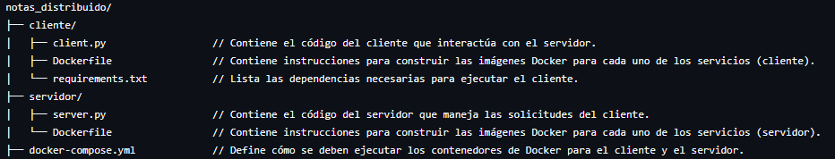

# Notas_distribuido
Este proyecto implementa un sistema de notas distribuido, en el que se usan contenedores Docker para alojar el servidor y el cliente que se comunican mediante sockets; permite al usuario crear, leer y eliminar notas. Además, puede exportar las notas en formato PDF/,txt, y se ha usado Docker para contenerizar tanto el servidor como el cliente.

## Organizacion de Contenido

## Instalación y Configuración del Proyecto
