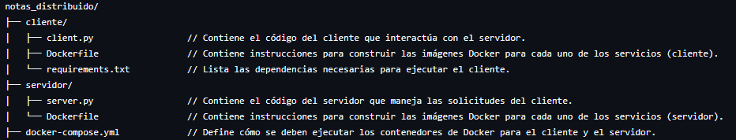
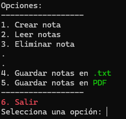

# Sistema de Notas [](https://github.com/sindresorhus/awesome#readme)
> README Description

Este proyecto implementa un sistema de notas distribuido, en el que se usan contenedores Docker para alojar el servidor y el cliente que se comunican mediante sockets; permite al usuario crear, leer y eliminar notas. 

Además, puede exportar las notas en formato PDF/,txt, y se ha usado Docker para contenerizar tanto el servidor como el cliente.


## Organizacion de Contenido


## Instalación y Configuración del Proyecto
**1. Clonar el repositorio...**

**2. Instalar Docker y Docker Compose:**

El proyecto utiliza Docker para crear contenedores. Si no tienes Docker instalado, sigue estos pasos:
- Descargar Docker e instalarlo según tu sistema operativo.
- Asegúrate de tener Docker Compose instalado.
    
Puedes comprobarlo ejecutando el siguiente comando en la terminal:

                                                `docker-compose --version`
**3. Instalar las dependencias del cliente:**

En el archivo *requirements.txt* se encuentran las dependencias necesarias para ejecutar el cliente. Para instalarlas, navega a la carpeta del cliente y ejecuta:

                                            `pip install -r requirements.txt`


**4. Configurar Docker:**

El proyecto incluye un *Dockerfile* tanto para el cliente como para el servidor. Asegúrate de que Docker esté configurado correctamente para poder crear los contenedores.

En la raíz del proyecto, en el mismo nivel que el archivo `docker-compose.yml`, ejecuta:

                                                `docker-compose build`


## Ejecutando Proyecto
Una vez que hayas configurado todo, puedes entrar a CMD; localiza la carpeta raiz del proyecto y ejecuta el siguiente comando:
                                                        
                                                `docker-compose run cliente` 

Esto correra tanto el cliente como el servidor a la vez y de forma interactiva; mostrandose de la siguiente manera:


La forma de interactuar con el cliente es **Seleccionar** la opción deseada, para luego **teclearla** y dar **ENTER**. De esa forma podrás
- Crear Notas
- Ver las Notas Creadas
- Borrar Notas

Además, tienes la posibilidad de **guardar** dichas nochas en dos formatos - siendo *PDF* y *.txt*. Dichos documentos se veran en:

```
├── Files/
│   ├── app/
│       └── client.py
│       └── notas.txt
│       └── notas.pdf
│       └── requirements.txt
```

Permitiendote asi, descargarlas.
